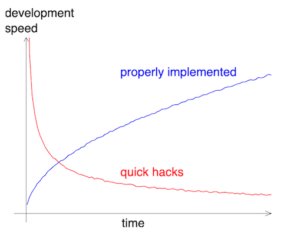

:::::::::::::::::::::::::::::::::::::: questions 

- What are the benefits of writing modular code in terms of maintenance and scalability?
- How can nested code be targeted and improved through modularization?

::::::::::::::::::::::::::::::::::::::::::::::::

::::::::::::::::::::::::::::::::::::: objectives

- Understand the key characteristics that make code modular and why it is advantageous.
- Learn strategies for identifying potential modules within complex code to improve readability and reusability.

::::::::::::::::::::::::::::::::::::::::::::::::

## What is modularity?

Modularity refers to the practice of building software from smaller, self-contained, and independent elements. Each element is designed to handle a specific set of tasks, contributing to the overall functionality of the system.

Key points about modularity:

- Software is constructed from smaller components.
- Components are self-contained and independent.
- Each component has a well-defined role.

Simple components combine to create complex behaviors.

Examples of modular elements:

- Functions
- Classes
- Modules
- Libraries/Packages
- Programs

## Benefits of writing modular code

### Increased robustness

- Well-designed modules can be tested individually.
- Testing individual modules helps maintain a well-functioning and bug-free codebase.

### Easier maintenance

- Modular code is more readable and understandable.
- Debugging is simplified as modules can be isolated and tested separately

### Reusability

- Modules can be reused in different projects or contexts.
- Promotes efficiency by leveraging existing code.

### Scalability

- Keeps complexity low by design.
- Facilitates scaling up without a proportional increase in complexity.

### Opportunities for innovation

- Enhances project capabilities and power.
- Existing modules can be rearranged for new applications.

## Characteristics of good modules



A good module performs limited and clearly defined tasks. 

::::::::::::::::::::::::::::::::::::: callout

## Readability

Readability is not necessarily about shorter code. It's about clarity and understanding.

Shorter:

```python
indexATG = [n for n,i in enumerate(myList) if i == 'ATG']
indexAAG = [n for n,i in enumerate(myList) if i == 'AAG']
```

More modular: 

```python
def getIndex(inputList,z):
    zIndex = [n for n,i in enumerate(li) if i == z]
    return zIndex

indexATG = getIndex(myList,'ATG')
indexAAG = getIndex(myList,'AAG')
```

::::::::::::::::::::::::::::::::::::::::::::::::

A good module:

- Performs limited and clearly defined tasks.
- Has a descriptive name.
- Is readable.
- Is pure and does not have side effects.

::::::::::::::::::::::::::::::::::::: callout

## Pure function vs stateful function

A pure function has no side-effects:

```python
def fahrenheit_to_celsius(temp_f):
    temp_c = (temp_f - 32.0) * (5.0/9.0)
    return temp_c
```

```console
>>> temp_c = fahrenheit_to_celsius(temp_f=77.0)
>>> print(temp_c)
```

```output
25.0
```

A stateful function changes its environment:

```python
def fahrenheit_to_celsius(temp_f):
    global temp_c
    temp_c = (temp_f - f_to_c_offset) * f_to_c_factor
```

```console
>>> f_to_c_offset = 32.0
>>> f_to_c_factor = (5.0/9.0)
>>> temp_c = 0.0
>>> print(temp_c)
```

```output
0.0
```

```console
>>> fahrenheit_to_celsius(temp_f=77.0)
>>> print(temp_c)
```

```output
25.0
```

::::::::::::::::::::::::::::::::::::::::::::::::

## Strategies for modularization

### Focus on readability

- Modular code is more readable.
- Code is read more often than it is written.
- Ensure that a reader can easily understand the code.
- Poor readability can be a "code smell."

### Identify future functions

- Apply the "Don't Repeat Yourself" (DRY) principle: place reused code into functions.
- Identify potential functions by their actions (e.g., "plotting," "transforming," "extracting," "saving").

### Target nested code

Nested code is a prime target for modularization.

Before modularization:

```python
def checkTemperature(degrees):
    if degrees < 0:
        if degrees < -273:
            if degrees < -459:
                print("This temperature is impossible.")
            else:
                print("This temperature is likely Fahrenheit.")
        else:
            print("This temperature is either Celsius or Fahrenheit.")
    else:
        print("This temperature is in Kelvin, Celsius, or Fahrhenheit.")
```

After modularization:

```python
def validTemp(degrees):
    if degrees < -459:
        return FALSE
    return TRUE

def checkTemperature(degrees):
    if not validTemp(degrees):
        return "invalid temperature"
    if degrees < 0:
        if degrees < -273:
            print("This temperature is likely Fahrenheit.")
        else:
            print("This temperature is either Celsius or Fahrenheit.")
    else:
        print("This temperature is in Kelvin, Celsius, or Fahrhenheit.")
```

### Use tests to guide modularization

- Write tests for each individual module.
- During test writing, critically evaluate the module's function:
  - Is the input/output clear?
  - Extract unclear parts into new modules for better testability.

::::::::::::::::::::::::::::::::::::: challenge 

## Modularity (20 min)

Carefully review the following code snippet:

```python
def convert_temperature(temperature, unit):
    if unit == "F":
        # Convert Fahrenheit to Celsius
        celsius = (temperature - 32) * (5 / 9)
        if celsius < -273.15:
            # Invalid temperature, below absolute zero
            return "Invalid temperature"
        else:
            # Convert Celsius to Kelvin
            kelvin = celsius + 273.15
            if kelvin < 0:
                # Invalid temperature, below absolute zero
                return "Invalid temperature"
            else:
                fahrenheit = (celsius * (9 / 5)) + 32
                if fahrenheit < -459.67:
                    # Invalid temperature, below absolute zero
                    return "Invalid temperature"
                else:
                    return celsius, kelvin
    elif unit == "C":
        # Convert Celsius to Fahrenheit
        fahrenheit = (temperature * (9 / 5)) + 32
        if fahrenheit < -459.67:
            # Invalid temperature, below absolute zero
            return "Invalid temperature"
        else:
            # Convert Celsius to Kelvin
            kelvin = temperature + 273.15
            if kelvin < 0:
                # Invalid temperature, below absolute zero
                return "Invalid temperature"
            else:
                return fahrenheit, kelvin
    elif unit == "K":
        # Convert Kelvin to Celsius
        celsius = temperature - 273.15
        if celsius < -273.15:
            # Invalid temperature, below absolute zero
            return "Invalid temperature"
        else:
            # Convert Celsius to Fahrenheit
            fahrenheit = (celsius * (9 / 5)) + 32
            if fahrenheit < -459.67:
                # Invalid temperature, below absolute zero
                return "Invalid temperature"
            else:
                return celsius, fahrenheit
    else:
        return "Invalid unit"
```

Refactor the code by extracting functions without altering its functionality.

- What functions did you create?
- What strategies did you use to identify them?

Share your answers in the collaborative document.

:::::::::::::::::::::::: solution 

## Solution 1 - Basic

```python
def celsius_to_fahrenheit(celsius):
    """
    Converts a temperature from Celsius to Fahrenheit.

    Args:
        celsius (float): The temperature in Celsius.

    Returns:
        float: The temperature in Fahrenheit.
    """
    return (celsius * (9 / 5)) + 32


def fahrenheit_to_celsius(fahrenheit):
    """
    Converts a temperature from Fahrenheit to Celsius.

    Args:
        fahrenheit (float): The temperature in Fahrenheit.

    Returns:
        float: The temperature in Celsius.
    """
    return (fahrenheit - 32) * (5 / 9)


def celsius_to_kelvin(celsius):
    """
    Converts a temperature from Celsius to Kelvin.

    Args:
        celsius (float): The temperature in Celsius.

    Returns:
        float: The temperature in Kelvin.
    """
    return celsius + 273.15


def kelvin_to_celsius(kelvin):
    """
    Converts a temperature from Kelvin to Celsius.

    Args:
        kelvin (float): The temperature in Kelvin.

    Returns:
        float: The temperature in Celsius.
    """
    return kelvin - 273.15


def check_temperature_validity(temperature, unit):
    """
    Checks if a temperature is valid for a given unit.

    Args:
        temperature (float): The temperature to check.
        unit (str): The unit of the temperature. Must be "C", "F", or "K".

    Returns:
        bool: True if the temperature is valid, False otherwise.
    """
    abs_zero = {"C": -273.15, "F": -459.67, "K": 0}
    if temperature < abs_zero[unit]:
        return False
    return True


def check_unit_validity(unit):
    """
    Checks if a unit is valid.

    Args:
        unit (str): The unit to check. Must be "C", "F", or "K".

    Returns:
        bool: True if the unit is valid, False otherwise.
    """
    if not unit in ["C", "F", "K"]:
        return False
    return True


def convert_temperature(temperature, unit):
    """
    Converts a temperature from one unit to another.

    Args:
        temperature (float): The temperature to convert.
        unit (str): The unit of the temperature. Must be "C", "F", or "K".

    Returns:
        tuple: A tuple containing the converted temperature in Celsius and Kelvin units.

    Raises:
        ValueError: If the unit is not "C", "F", or "K".
        ValueError: If the temperature is below absolute zero for the given unit.

    Examples:
        >>> convert_temperature(32, "F")
        (0.0, 273.15)
        >>> convert_temperature(0, "C")
        (32.0, 273.15)
        >>> convert_temperature(273.15, "K")
        (0.0, -459.67)
    """
    if not check_unit_validity(unit):
        raise ValueError("Invalid unit")
    if not check_temperature_validity(temperature, unit):
        raise ValueError("Invalid temperature")
    if unit == "F":
        celsius = fahrenheit_to_celsius(temperature)
        kelvin = celsius_to_kelvin(celsius)
        return celsius, kelvin
    if unit == "C":
        fahrenheit = celsius_to_fahrenheit(temperature)
        kelvin = celsius_to_kelvin(temperature)
        return fahrenheit, kelvin
    if unit == "K":
        celsius = kelvin_to_celsius(temperature)
        fahrenheit = celsius_to_fahrenheit(celsius)
        return celsius, fahrenheit

if __name__ == "__main__":
    print(convert_temperature(0, "C"))
    print(convert_temperature(0, "F"))
    print(convert_temperature(0, "K"))
    print(convert_temperature(-500, "K"))
    print(convert_temperature(-500, "C"))
    print(convert_temperature(-500, "F"))
    print(convert_temperature(-500, "B"))
```

:::::::::::::::::::::::::::::::::
:::::::::::::::::::::::: solution

## Solution 2 - Advanced

```python
class TemperatureConverter:
    """
    A class for converting temperatures between Celsius, Fahrenheit, and Kelvin.
    """

    def __init__(self):
        """
        Initializes the TemperatureConverter object with a dictionary of absolute zero temperatures for each unit.
        """
        self.abs_zero = {"C": -273.15, "F": -459.67, "K": 0}

    def celsius_to_fahrenheit(self, celsius):
        """
        Converts a temperature from Celsius to Fahrenheit.

        Args:
            celsius (float): The temperature in Celsius.

        Returns:
            float: The temperature in Fahrenheit.
        """
        return (celsius * (9 / 5)) + 32

    def fahrenheit_to_celsius(self, fahrenheit):
        """
        Converts a temperature from Fahrenheit to Celsius.

        Args:
            fahrenheit (float): The temperature in Fahrenheit.

        Returns:
            float: The temperature in Celsius.
        """
        return (fahrenheit - 32) * (5 / 9)

    def celsius_to_kelvin(self, celsius):
        """
        Converts a temperature from Celsius to Kelvin.

        Args:
            celsius (float): The temperature in Celsius.

        Returns:
            float: The temperature in Kelvin.
        """
        return celsius + 273.15

    def kelvin_to_celsius(self, kelvin):
        """
        Converts a temperature from Kelvin to Celsius.

        Args:
            kelvin (float): The temperature in Kelvin.

        Returns:
            float: The temperature in Celsius.
        """
        return kelvin - 273.15

    def check_temperature_validity(self, temperature, unit):
        """
        Checks if a given temperature is valid for a given unit.

        Args:
            temperature (float): The temperature to check.
            unit (str): The unit to check the temperature against.

        Returns:
            bool: True if the temperature is valid for the unit, False otherwise.
        """
        if temperature < self.abs_zero[unit]:
            return False
        return True

    def check_unit_validity(self, unit):
        """
        Checks if a given unit is valid.

        Args:
            unit (str): The unit to check.

        Returns:
            bool: True if the unit is valid, False otherwise.
        """
        if unit not in ["C", "F", "K"]:
            return False
        return True

    def convert_temperature(self, temperature, unit):
        """
        Converts a temperature from one unit to another.

        Args:
            temperature (float): The temperature to convert.
            unit (str): The unit of the temperature.

        Returns:
            tuple: A tuple containing the converted temperature in the other two units.
        """
        if not self.check_unit_validity(unit):
            raise ValueError("Invalid unit")
        if not self.check_temperature_validity(temperature, unit):
            raise ValueError("Invalid temperature")
        if unit == "F":
            celsius = self.fahrenheit_to_celsius(temperature)
            kelvin = self.celsius_to_kelvin(celsius)
            return celsius, kelvin
        if unit == "C":
            fahrenheit = self.celsius_to_fahrenheit(temperature)
            kelvin = self.celsius_to_kelvin(temperature)
            return fahrenheit, kelvin
        if unit == "K":
            celsius = self.kelvin_to_celsius(temperature)
            fahrenheit = self.celsius_to_fahrenheit(celsius)
            return celsius, fahrenheit

if __name__ == "__main__":
    converter = TemperatureConverter()
    print(converter.convert_temperature(0, "C"))
    print(converter.convert_temperature(0, "F"))
    print(converter.convert_temperature(0, "K"))
    print(converter.convert_temperature(-500, "K"))
    print(convert_temperature(-500, "C"))
    print(convert_temperature(-500, "F"))
    print(convert_temperature(0, "X"))
```

:::::::::::::::::::::::::::::::::
::::::::::::::::::::::::::::::::::::::::::::::::

::::::::::::::::::::::::::::::::::::: keypoints 

- Software is built from smaller, self-contained elements, each handling specific tasks.
- Modular code enhances robustness, readability, and ease of maintenance.
- Modules can be reused across projects, promoting efficiency.
- Good modules perform limited, defined tasks and have descriptive names.
- Focus on readability and use tests to guide modularization.

::::::::::::::::::::::::::::::::::::::::::::::::
