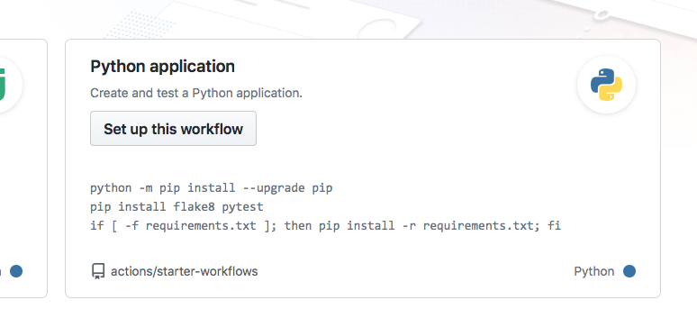
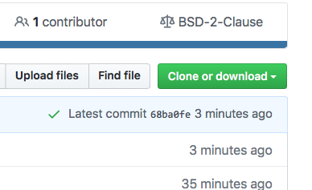

:::::::::::::::::::::::::::::::::::::: questions 

- How can we implement automatic testing each time we push changes to the repository?


::::::::::::::::::::::::::::::::::::::::::::::::

::::::::::::::::::::::::::::::::::::: objectives

- Set up Continuous Integration using GitHub Actions

::::::::::::::::::::::::::::::::::::::::::::::::

## Introducing Continuous integration
Follow [these slides](https://esciencecenter-digital-skills.github.io/digital-skills-slides/modules/good-practices-lesson/ci-slides) to understand 
the basics of continuous integration.

## Full-cycle collaborative workflow

::: challenge 

### Exercise: Full-cycle collaborative workflow

The exercise takes 30-40 minutes.

In this exercise, everybody will:

- A. Set up automated tests with GitHub Actions
- B. Make test fail / find a bug in their repository
- C. Open an issue in their repository
- D. Then each one will clone the repo of one of their exercise partners, fix the bug, and open a pull request (GitHub)
- E. Everybody then merges their co-worker’s change


#### Step 1: Create a new repository on GitHub

- Select a different repository name than your colleagues (otherwise forking the same name will be strange)
- Before you create the repository, select “Initialize this repository with a README” (otherwise you try to clone an empty repo).
- Share the repository URL with your exercise group via shared document or chat

#### Step 2: Clone your own repository, add code, commit, and push

Clone the repository.

Add a file `example.py` containing:

```python
def add(a, b):
    return a + b

def subtract(a, b):
    return a + b  # do not change this line until prompted to do so.
```

Write a test function `def test_add()` for `add` to check that this function is working properly. Do NOT add a test function for `subtract` (yet).
Run pytest to ensure it works 

Then stage the file (`git add <filename>`), commit (`git commit -m "some commit message"`),
and push the changes (`git push`).


#### Step 3: Enable automated testing

In this step we will enable GitHub Actions.
- Select "Actions" from your GitHub repository page. You get to a page "Get started with GitHub Actions". 
- Select the button for "Set up this workflow" under Python Application.


Select “Python application” as the starter workflow.

GitHub creates the following file for you in the subfolder `.github/workflows`:


```yaml
# This workflow will install Python dependencies, run tests and lint with a single version of Python
# For more information see: https://help.github.com/actions/language-and-framework-guides/using-python-with-github-actions

name: Python application

on:
  push:
    branches: [ main ]
  pull_request:
    branches: [ main ]

jobs:
  build:

    runs-on: ubuntu-latest

    steps:
    - uses: actions/checkout@v2
    - name: Set up Python 3.9
      uses: actions/setup-python@v2
      with:
        python-version: 3.9
    - name: Install dependencies
      run: |
        python -m pip install --upgrade pip
        pip install flake8 pytest
        if [ -f requirements.txt ]; then pip install -r requirements.txt; fi
    - name: Lint with flake8
      run: |
        # stop the build if there are Python syntax errors or undefined names
        flake8 . --count --select=E9,F63,F7,F82 --show-source --statistics
        # exit-zero treats all errors as warnings. The GitHub editor is 127 chars wide
        flake8 . --count --exit-zero --max-complexity=10 --max-line-length=127 --statistics
    - name: Test with pytest
      run: |
        pytest
```


Commit the change by pressing the "Start Commit" button.

#### Step 4: Verify that tests have been automatically run

Observe in the repository how the test succeeds. While the test is executing, the repository has a yellow marker.
This is replaced with a green check mark, once the test succeeds.



Green check means passed.

Also browse the "Actions" tab and look at the steps there and their output.

#### Step 5: Add a test which reveals a problem

After you committed the workflow file, your GitHub repository will be ahead of your local cloned repository. Update your local cloned repository:

```
$ git pull origin main
```

Next uncomment add a test function `test_subtract` for to check that the `subtract` function can subtract two numbers from each other, and push it to your remote repository.
Verify that the test suite now fails on the “Actions” tab (GitHub).


#### Step 6: Open an issue on GitHub
Open a new issue in your repository about the broken test (click the “Issues” button on GitHub and write a title for the issue). The plan is that your colleague will fix the issue through a pull request

#### Step 7: Fork and clone the repository of your colleague

Fork the repository using the GitHub web interface. 
Make sure you clone the fork after you have forked it. Do not clone your colleague’s repository directly.


#### Step 8: Fix the broken test

Fix the function now and run pytest to check that it works.
Then push to _your fork_. Check whether the action now also passes.

#### Step 9: Open a pull request (GitHub)

Then before accepting the pull request from your colleague, observe how GitHub Actions automatically tested the code.

If you forgot to reference the issue number in the commit message, you can still add it to the pull request: 
`my pull request title, closes #NUMBEROFTHEISSUE`

#### Step 10

Observe how accepting the pull request automatically closes the issue (provided the commit message or the pull request contained the correct issue number).

Discuss whether this is a useful feature. And if it is, why do you think is it useful?

:::

::::::::::::::::::::::::::::::::::::: keypoints 

- Use GitHub Actions to automate checking your code each time you push changes to the repository.

::::::::::::::::::::::::::::::::::::::::::::::::


