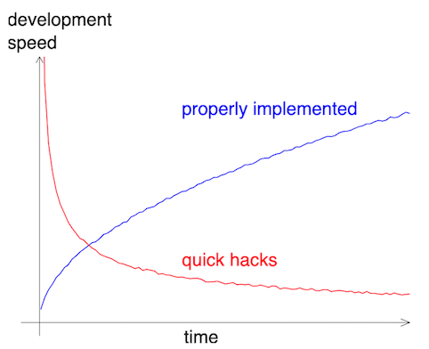

:::::::::::::::::::::::::::::::::::::: questions 

- What are the benefits of writing modular code in terms of maintenance and scalability?
- How can nested code be targeted and improved through modularization?

::::::::::::::::::::::::::::::::::::::::::::::::

::::::::::::::::::::::::::::::::::::: objectives

- Understand the key characteristics that make code modular and why it is advantageous.
- Learn strategies for identifying potential modules within complex code to improve readability and reusability.

::::::::::::::::::::::::::::::::::::::::::::::::

## What is modularity?

Modularity refers to the practice of building software from smaller, self-contained, and independent elements. Each element is designed to handle a specific set of tasks, contributing to the overall functionality of the system.

Key points about modularity:

- Software is constructed from smaller components.
- Components are self-contained and independent.
- Each component has a well-defined role.

Simple components combine to create complex behaviors.

Examples of modular elements:

- Functions
- Classes
- Modules
- Libraries/Packages
- Programs

## Benefits of writing modular code

### Increased robustness

- Well-designed modules can be tested individually.
- Testing individual modules helps maintain a well-functioning and bug-free codebase.

### Easier maintenance

- Modular code is more readable and understandable.
- Debugging is simplified as modules can be isolated and tested separately

### Reusability

- Modules can be reused in different projects or contexts.
- Promotes efficiency by leveraging existing code.

### Scalability

- Keeps complexity low by design.
- Facilitates scaling up without a proportional increase in complexity.

### Opportunities for innovation

- Enhances project capabilities and power.
- Existing modules can be rearranged for new applications.

## Characteristics of good modules



A good module performs limited and clearly defined tasks. 

::::::::::::::::::::::::::::::::::::: callout

## Readability

Readability is not necessarily about shorter code. It's about clarity and understanding.

Shorter:

```python
indexATG = [n for n,i in enumerate(myList) if i == 'ATG']
indexAAG = [n for n,i in enumerate(myList) if i == 'AAG']
```

More modular: 

```python
def getIndex(inputList,z):
    zIndex = [n for n,i in enumerate(li) if i == z]
    return zIndex

indexATG = getIndex(myList,'ATG')
indexAAG = getIndex(myList,'AAG')
```

::::::::::::::::::::::::::::::::::::::::::::::::

A good module:

- Performs limited and clearly defined tasks.
- Has a descriptive name.
- Is readable.
- Is pure and does not have side effects.

::::::::::::::::::::::::::::::::::::: callout

## Pure function vs stateful function

A pure function has no side-effects:

```python
def fahrenheit_to_celsius(temp_f):
    temp_c = (temp_f - 32.0) * (5.0/9.0)
    return temp_c
```

```console
>>> temp_c = fahrenheit_to_celsius(temp_f=77.0)
>>> print(temp_c)
```

```output
25.0
```

A stateful function changes its environment:

```python
def fahrenheit_to_celsius(temp_f):
    global temp_c
    temp_c = (temp_f - f_to_c_offset) * f_to_c_factor
```

```console
>>> f_to_c_offset = 32.0
>>> f_to_c_factor = (5.0/9.0)
>>> temp_c = 0.0
>>> print(temp_c)
```

```output
0.0
```

```console
>>> fahrenheit_to_celsius(temp_f=77.0)
>>> print(temp_c)
```

```output
25.0
```

::::::::::::::::::::::::::::::::::::::::::::::::

## Strategies for modularization

### Focus on readability

- Modular code is more readable.
- Code is read more often than it is written.
- Ensure that a reader can easily understand the code.
- Poor readability can be a "code smell."

### Identify future functions

- Apply the "Don't Repeat Yourself" (DRY) principle: place reused code into functions.
- Identify potential functions by their actions (e.g., "plotting," "transforming," "extracting," "saving").

### Target nested code

Nested code is a prime target for modularization.

Before modularization:

```python
def checkTemperature(degrees):
    if degrees < 0:
        if degrees < -273:
            if degrees < -459:
                print("This temperature is impossible.")
            else:
                print("This temperature is likely Fahrenheit.")
        else:
            print("This temperature is either Celsius or Fahrenheit.")
    else:
        print("This temperature is in Kelvin, Celsius, or Fahrhenheit.")
```

After modularization:

```python
def validTemp(degrees):
    if degrees < -459:
        return FALSE
    return TRUE

def checkTemperature(degrees):
    if not validTemp(degrees):
        return "invalid temperature"
    if degrees < 0:
        if degrees < -273:
            print("This temperature is likely Fahrenheit.")
        else:
            print("This temperature is either Celsius or Fahrenheit.")
    else:
        print("This temperature is in Kelvin, Celsius, or Fahrhenheit.")
```

### Use tests to guide modularization

- Write tests for each individual module.
- During test writing, critically evaluate the module's function:
  - Is the input/output clear?
  - Extract unclear parts into new modules for better testability.

::::::::::::::::::::::::::::::::::::: challenge 

## Title (20 min)

[...]

:::::::::::::::::::::::: solution 

## Solution
 
[...]

:::::::::::::::::::::::::::::::::
::::::::::::::::::::::::::::::::::::::::::::::::

::::::::::::::::::::::::::::::::::::: keypoints 

- Software is built from smaller, self-contained elements, each handling specific tasks.
- Modular code enhances robustness, readability, and ease of maintenance.
- Modules can be reused across projects, promoting efficiency.
- Good modules perform limited, defined tasks and have descriptive names.
- Focus on readability and use tests to guide modularization.

::::::::::::::::::::::::::::::::::::::::::::::::
